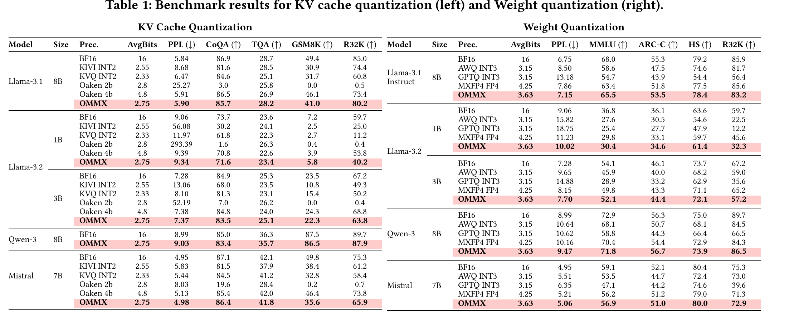
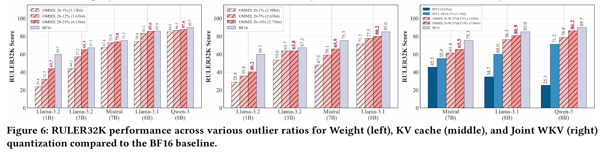
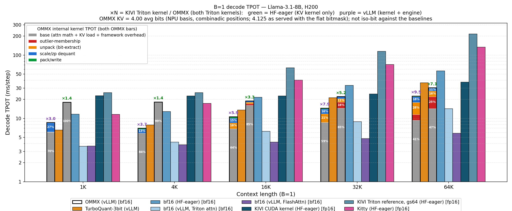
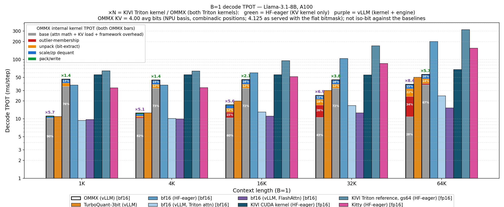
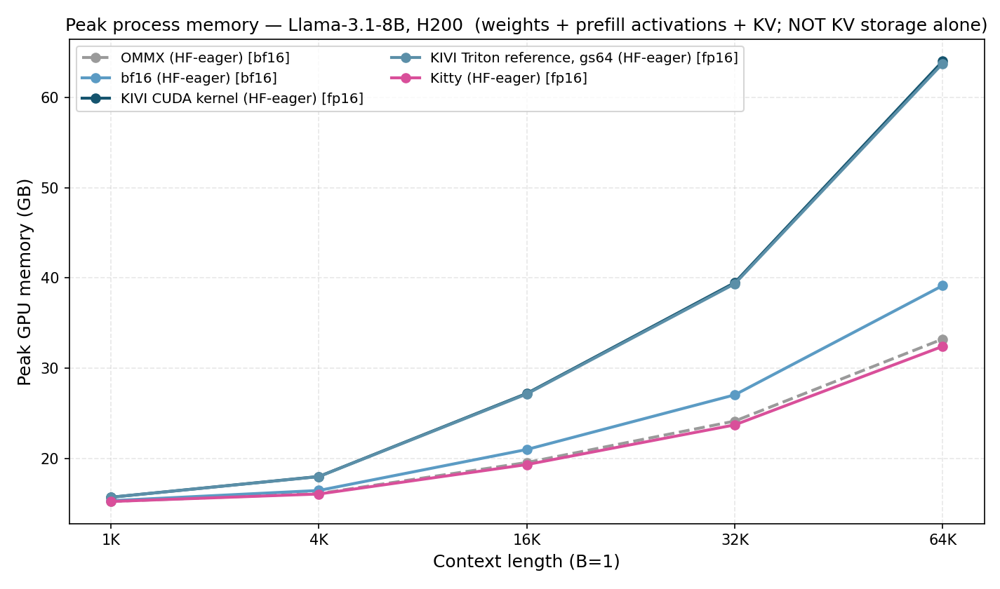
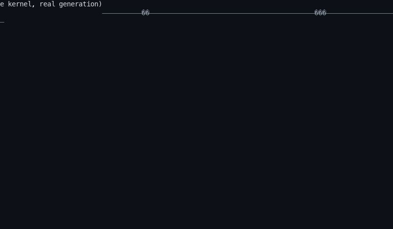
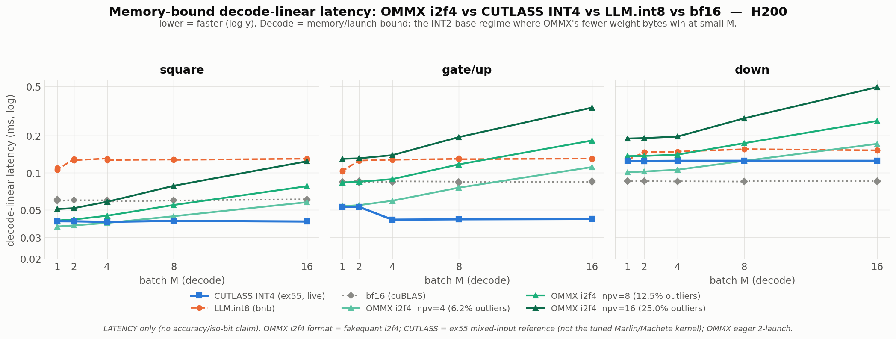

# High-Coverage Outlier Representation in Low-Bit MX Formats for Efficient LLM Inference (ICCAD 2026)

Outliers are the main reason low-bit LLM quantization loses resolution and, with it, model
robustness. **OMMX (Outlier-Managed-MX)** is a **dual-resolution format** — MXINT for the dense
majority, MXFP for the outlier region — that widens outlier coverage while keeping a compact,
bundle-packed data layout, and it is integrated into LLM serving through HW-SW co-design.

This repository releases the **inference-accuracy evaluation** of OMMX against other baselines, and
the **GPU serving kernels** integrated into vLLM and HF-eager.

> **OMMX** casts ultra-low-bit quantization as a dual-resolution MX format — **MXINT2** for the
> dense majority, **MXFP4** for a high-coverage outlier region under a shared power-of-two scale —
> keeping a bundle-packed layout that a custom CUDA/Triton kernel executes inside vLLM. This repo
> releases the accuracy evaluation (OMMX vs baselines) and the GPU serving kernels (vLLM + HF-eager).

---

## Results at a glance

**Accuracy / bit tradeoff** (from the paper — `lm_eval`, 5 model families):

|  |
|:--:|
| **Table 1** — KV-cache (left) + weight (right) quantization vs KIVI / KVQ / Oaken / AWQ / GPTQ / MXFP4. |

|  |
|:--:|
| **Fig. 6** — RULER-32K vs outlier ratio (Weight / KV / joint WKV): accuracy recovers as outlier coverage grows. |

**Serving — B=1 decode TPOT** (Llama-3.1-8B, greedy, CUDA-event timed, seed=42). The three TPOT /
peak-memory figures below, and the H200 TPOT table further down, are all drawn from
`figure/data_*/` — the **already-published measurement set**, produced by an earlier
`figure/bench.py` that ran all four HF arms in **float16** and gave the bf16 arm a stock
`DynamicCache`. The current bench does neither — read *How these numbers were produced*, beside the
H200 TPOT table, before citing any of them. (The KIVI fused-GQA, needle-retrieval and linear-parity
tables further down are *separate* H100 NVL measurements, labelled where they appear.)

|  |
|:--:|
| **H200** — OMMX (vLLM / HF-eager), bf16 (vLLM / HF-eager), KIVI, Kitty, TurboQuant. `OMMX (vLLM)` is the OMMX paged-decode **KV/attention** kernel under vLLM (bf16 weights + INT2/FP4 KV — a KV-quant comparison, *not* weight-quantized OMMX); its bar is split into the kernel's internal stages (base attention / outlier-membership / unpack / scale-zp dequant / pack-write). On sm_90 the OMMX decode runs **piecewise** (a full CUDA-graph would freeze the per-step metadata), so vLLM-native `TurboQuant` (3-bit KV via `--kv-cache-dtype`) is faster single-stream here — OMMX's edge is **accuracy at low bits**, not sm_90 latency. |

|  |
|:--:|
| **A100** — the same methods on A100-SXM4-80GB. Same-engine (HF-eager), OMMX beats KIVI **×1.4→×2.4** across 1K→64K and passes Kitty from 16K on (×1.2→×1.5; Kitty leads at 1K and 4K). Low-bit-KV dequant makes OMMX (HF-eager) trail 16-bit bf16 at every context (×1.8 at 1K → ×3.3 at 64K) — OMMX's win is over the other **quant** methods and in memory, not over bf16 speed. Against **TurboQuant**, `OMMX (vLLM)` is faster at **every** context on A100 — ×1.9 at 1K narrowing to ×1.5 at 64K (14.5→76.3 vs 27.5→116.6 ms) — because TurboQuant's Walsh–Hadamard rotation is much slower on sm_80, which flips the sm_90 ranking. |

|  |
|:--:|
| **Peak process memory** (weights + prefill activations + KV) — *not* KV storage. OMMX / Kitty stay low; the KIVI spike is its HF-eager `_eval` decode path (full-KV fp16 dequant + dense matmul each step), not a larger *stored* KV cache. |

**Demo — live inference.** An `asciinema` recording of the **actual OMMX paged-decode kernel**
generating on H200 (Llama-3.1-8B, 32k context), streaming each token with a running tok/s
(`figure/demo_gen.py --live`, rasterized by `figure/demo_cast_to_gif.py`):



**Demo — 4-method comparison.** Four real generations (H200, best recipe) replayed side by side at
their real relative speed: bf16 (29 tok/s) and **OMMX (23)** finish well ahead of KIVI / Kitty (~10).
The timing is real (steady-state tok/s, one-time Triton JIT excluded); the side-by-side layout is a replay.


> **The demo tools need dependencies no extra declares.** `figure/demo_cast_to_gif.py` imports
> `pyte` + `Pillow` and `figure/demo_tui.py` imports `rich`; none of the three is in any
> `pyproject.toml` extra — `pip install pyte pillow rich` on top of `.[ommx]`.
> `figure/demo_gen.py` itself needs only `.[ommx]`. Nothing in the measured pipeline (`run.sh`,
> `figure/bench.py`, `collect.py`, `plot.py`) imports any of them.

## What reproduces (measured)

All OMMX numbers use the **canonical best recipe** (INT2 base + **12-of-64 FP4 K-outliers**, sink 8,
pow2 scales), selected by `OMMX_ATTN_OUTLIERS=6 OMMX_ATTN_POW2=1 OMMX_ATTN_K_FORMAT=i2f4
OMMX_KV_GROUP_TOKENS=32 OMMX_KV_SINK=8 OMMX_KV_RECENT=32` — set identically in `figure/bench.py` and
`eval/lm_eval/models/ommx_hf_model.py`.

Each method uses **its own best low-bit-KV recipe** (not iso-bit):

| method | KV recipe | avg KV bits | bf16 tail |
|---|---|--:|---|
| **OMMX** | INT2 base + 12/64 FP4 K-outliers, pow2 scales | **4.375** | sink 8 + recent 32 |
| KIVI | 2-bit K/V, group 32 | ~2.55 | residual 128 |
| Kitty | 2-bit K/V + 25% INT4-channel boost | ~2.5 | sink 32 |

**OMMX is the highest-bit method here, not the lowest.** Its **4.375** average KV bits
(**K 6.00, V 2.75**) buy the paper's high-coverage accuracy — so the speed and memory numbers are
**not** an equal-bit comparison. OMMX trades ~1.7× more KV bits than KIVI / Kitty for accuracy.

> **The 4.375 figure is measured, not derived.** It is the sum of the tensors
> `MultiSeqKVPool` actually allocates for the canonical recipe (`k_base`, `v_main`, `k_scale`,
> `k_zp`, `v_scale`, `v_zp`, the two dedicated FP4 range-map planes, `k_oidx`, `k_oval`), divided
> by the stored KV elements: **8.750 bit per (K,V) element pair → 4.375 average, 3.66× vs bf16.**
> An earlier revision of this table said ~4.1 (3.88×) because the accounting helper omitted the
> two `k_fp4_mapscale` / `k_fp4_mapcenter` planes, which `OMMX_KV_OUTLIER_MAP` allocates **by
> default**. `ommx_gpu_serve/tests/test_bit_accounting.py` now pins the corrected numbers against
> an independent recomputation.
>
> **A "≤3-bit" OMMX exists but is a different recipe.** `group_tokens=64` + `group_channels=64` +
> `OMMX_KV_OUTLIER_MAP=0` measures 5.875 bit/pair (2.938 average, 5.45×). `attention/pack.py`
> calls it "its OWN fakequant oracle … a different number system" from the dedicated-map recipe.
> **The accuracy results in Table 1 / Fig. 6 were produced with the 4.375-bit recipe**, so the
> ≤3-bit configuration has no accuracy number in this repo and must not be quoted alongside them.

**KIVI's decode path — measured, not assumed.** The published KIVI numbers use its HF-eager `_eval`
decode path (Triton pack + dequant + `torch.matmul` GEMV). This repo also carries a purpose-built
GQA extension for KIVI's *fused* dequant+matmul kernel, behind `KIVI_FUSED_GQA=1`. Both were timed
on one H100 NVL, both paths fully pre-warmed, each cell run in both orders, with KIVI's own
`_kivi_fused_fires` counter proving which kernel executed (token output identical, 48/48):

| ctx | dequant fallback (default) | fused GQA | fallback / fused (>1 = fused faster) |
|----:|---------------------------:|----------:|-----------------:|
| 1K  | 67.98 / 70.88 ms | 60.24 / 59.27 ms | **1.16×** |
| 4K  | 66.63 / 68.33 ms | 106.24 / 107.55 ms | 0.63× |
| 16K | 144.10 / 130.03 ms | 360.51 / 338.76 ms | **0.39×** |

The default (fallback) is therefore the **faster** KIVI at every context ≥ 4K — running it is not a
handicap. `KIVI_FUSED_GQA=1` is available and `kivi_fused_stats()` records which path a run took.

**H200, decode TPOT (ms/step)** — HF-eager (OMMX also shown under vLLM):

| ctx | bf16 | **OMMX (hf)** | OMMX (vLLM) | KIVI | Kitty |
|----:|-----:|--------------:|------------:|-----:|------:|
| 1K  | 31.4 | **17.7** | 9.5  | 29.4 | 11.6 |
| 4K  | 31.8 | **22.1** | 8.4  | 29.2 | 17.0 |
| 16K | 32.7 | **25.3** | 18.0 | 52.7 | 39.8 |
| 32K | 34.3 | **41.7** | 30.1 | 89.6 | 70.7 |
| 64K | 37.4 | **69.8** | 51.3 | 163.5 | 132.1 |

> **How these numbers were produced — read before citing them.** The table is
> `figure/data/h200.json` verbatim: the already-published set, produced by an earlier
> `figure/bench.py`, so re-running the [Reproduce](#reproduce) commands does **not** reproduce
> it. Three things have to be said before any row is quoted.
>
> - **The bf16 column carries a `DynamicCache` handicap.** That arm used stock `transformers`
>   `DynamicCache`, which re-`torch.cat`s the whole KV every decode step — something no
>   quantized arm does. A same-process A/B on an **H100 NVL** (not this H200), the cache object
>   the only difference, measured `StaticCache` **3.09× / 2.59× / 3.17×** faster at 1K / 4K /
>   16K. An unhandicapped bf16 arm therefore lands *below* the OMMX (hf) column, i.e. **the
>   OMMX-beats-bf16 ordering in the rows above inverts at 1K–16K.** `figure/bench.py` now
>   defaults to `--bf16-cache static`.
> - **Every HF arm here ran in `float16`**, including the one labelled bf16 (`meta.dtype` in each
>   `figure/data_h200/*_hf.json`). The current bench runs bf16 / ommx / kitty in bfloat16 and
>   records the resolved dtype per arm.
> - **The OMMX column is a median and misses most of the regroup tail.** OMMX repacks every
>   `OMMX_KV_GROUP_TOKENS` (=32) decode steps. Measured over 240 steps on an H100 NVL the
>   boundaries are perfectly periodic (23, 55, 87, 119, 151, 183, 215) and cost 86–140 ms against
>   a 34–40 ms steady-state step — **+17% amortized** — and the shipped `--measure 40` window
>   reaches only the first of them. `mean_ms` is the honest per-token cost, the median is the
>   steady-state one; quote both.
>
> `repro/README.md` holds the full provenance audit of these files (including their `p99`, which
> was really the maximum). The same warning is repeated at the end of [Reproduce](#reproduce).

- **Fastest low-bit-KV decode among the quantized methods from 16K up — not at short context.**
  All four arms run under HF-eager. OMMX beats **KIVI ×1.7→×2.3 (H200) / ×1.4→×2.4 (A100)**
  across 1K→64K, but passes **Kitty** only from 16K on (H200 ×1.6→×1.9, A100 ×1.2→×1.5 over
  16K→64K): **Kitty is faster at 1K and 4K on both GPUs** (H200 11.6 vs 17.7 and 17.0 vs 22.1 ms).
  KIVI / Kitty have no vLLM path, so the `×N` label is HF-eager. Accuracy is a *separate* axis
  (Table 1 / Fig. 6).
  > **"Same engine" means same framework, NOT same code.** The four arms are four DIFFERENT model
  > implementations: bf16 is stock `transformers` `AutoModelForCausalLM`, while ommx
  > (`ommx_gpu_serve/hf_eager/_ommx_llama_modeling.py`), kivi
  > (`baseline/kivi/models/llama_kivi_eval.py`) and kitty
  > (`baseline/kitty/_kitty_llama_modeling.py`) are each a separate hand-written model file with
  > its own cache object and its own per-step Python overhead. **At short context that overhead,
  > not the KV kernel, dominates**: an 8B model on H200 is ~3 ms/step at the memory roofline, yet
  > every arm here measures 12–31 ms/step at 1K. This is why OMMX (hf) can appear *faster than
  > bf16* at 1K — it is a scaffold difference, not a KV-quantization result. Treat the ≥16K rows,
  > where KV traffic actually dominates, as the meaningful comparison.
  > `--bf16-cache static` (now the default in `figure/bench.py`) removes the largest single
  > scaffold asymmetry: stock `DynamicCache` re-`torch.cat`s the whole KV every decode step, which
  > none of the quantized arms do.
- **Mixed dtype, by necessity and on the record.** In the **current** bench (`run.sh` →
  `figure/bench.py`) the bf16 / ommx / kitty arms run **bfloat16** and the KIVI arm runs
  **float16**, because KIVI's packer hard-casts every dequantized K/V to
  `torch.float16` (`baseline/kivi/quant/new_pack.py`) and its kernel allocates an fp16 output, so
  a bfloat16 KIVI run raises rather than producing a number. `run.sh` passes the dtype explicitly
  per arm and `figure/bench.py` records the resolved dtype in the JSON so the legend cannot
  mislabel it. **The table above is not such a run**: it predates the per-arm dtype and ran
  **every** HF arm in float16 while labelling one of them "bf16".
- **Slower than 16-bit bf16 — the honest tradeoff.** OMMX's decode is dequant-bound (outlier-membership
  + unpack + scale/zp), so at long context it trails bf16, which does no dequant but stores **3.66×
  the KV bytes OMMX does** (16 bit/element against the measured 4.375 of the published recipe — the
  accounting above; *not* the ≤3-bit lever, and not a comparison against KIVI / Kitty). The memory
  win is **shared** — OMMX, KIVI and Kitty all keep the KV quantized in HBM; OMMX's
  edge over them is decode speed + accuracy, not a smaller cache.
- **The same OMMX kernel is ≈ 1.9× faster under vLLM than under HF-eager** (9.5 vs 17.7 ms @1K).
  The win is the surrounding engine — vLLM's per-step path against a hand-written HF-eager model
  file — **not** CUDA-graph capture of the OMMX decode: on sm_90 `get_cudagraph_support` in
  `integration/vllm/backend.py` declares `NEVER`, so vLLM deliberately keeps the OMMX attention
  **out** of the graph (piecewise), as the H200 caption above says. A100/sm_80 is the arch where
  the OMMX decode is captured.

**KV recipe ↔ fakequant parity.** The serving kernel and the `ommx_fakequant/` accuracy model share the
canonical recipe: CoQA f1 matches within 0.01, and WikiText-2 4K-chunked PPL is bit-identical between the
open extract and upstream. The served path is `ommx_gpu_serve` (`kv_store.py` + `pack.py` + `codec.py`);
`ommx_fakequant/` is the separate accuracy simulator.

## Named recipes — reproducing a published bit budget is a flag, not a guess

The bit budgets the paper's Table 1 reports are **reachable in this code, but they are not
the defaults**, and until now an operator had to hand-assemble a dozen environment
variables and hope. `ommx_gpu_serve/recipes.py` is a registry of named, **measured**,
tested recipes; `python3 -m ommx_gpu_serve.recipes list` prints it and
`… recipes verify` recomputes every number from the live code.

| recipe | axis | measured | claim | accuracy in this repo |
|---|---|--:|---|---|
| `shipped-kv` | KV | **4.3750** avg bit/elem (K 6.0000 / V 2.7500, 3.657×) | — | **yes** — every published OMMX number |
| `paper-kv` | KV | **2.7500** avg bit/elem (K 3.3125 / V 2.1875, 5.818×) | **E1** | **none** |
| `shipped-weight` | weight | **4.1250** bit/weight | — | none |
| `paper-weight` | weight | **3.6250** bit/weight *on disk* | **E2**, B4, B6 | none |

```bash
# KV — one flag, on the serving path, the bench, or the eval harness
OMMX_RECIPE=paper-kv vllm serve <model> --attention-backend CUSTOM ...
./run.sh bench --recipe paper-kv --tag a100          # a sweep that NAMES its recipe

# weight — one flag on the offline packer
python3 -m ommx_gpu_serve.linear.w_packer pack --preset paper-weight \
    --input /models/Llama-3.1-8B-Instruct --output /models/llama31-8b-paper
```

An explicit environment variable (or CLI flag) always beats the preset, so a preset can be
overridden one knob at a time; an unknown name raises and lists the known ones. With no
preset named, nothing is applied and the shipped defaults resolve exactly as before.

> **Where `OMMX_RECIPE` alone is not enough.** The preset is expanded lazily, inside
> `config.resolve_serving_config`. The vLLM serving path is fine (`backend.py` resolves the
> config before preflight and before any pool is built), but a tool that reads the recipe
> env *directly* and never calls that function sees the bare defaults — measured:
> `OMMX_RECIPE=paper-kv` + `kv_bits_breakdown(128)` reports **4.125** avg bits standalone
> and **2.75** after a `resolve_serving_config()` in the same process. And because a
> preset never overwrites a value already in the environment, a module that installs its
> own defaults FIRST wins: `OMMX_RECIPE=paper-kv python3 figure/bench.py --method ommx`
> runs `shipped-kv` (`figure/bench.py` calls `os.environ.setdefault` on the canonical
> dict at model-build time). `resolve_serving_config` now records the conflicting knobs in
> `cfg.extra["ommx_recipe_overridden"]` so such a run is not silently mislabelled.
> **Use `./run.sh --recipe NAME`**, which exports the assignments into the shell before any
> child starts, or export the preset's env yourself
> (`eval "$(python3 -m ommx_gpu_serve.recipes env paper-kv --export)"`).

> ### `paper-kv` HAS NO ACCURACY MEASUREMENT IN THIS REPO
>
> Every accuracy number this release publishes — CoQA/PPL through
> `eval/lm_eval/models/ommx_hf_model.py`, the 4K/16K needle gate — was produced with
> **`shipped-kv`**, which measures **4.375** average KV bits, not the 2.75 of claim **E1**.
> `paper-kv` moves the group geometry (32→128 on both axes) and the outlier budget (6→10),
> which changes what is quantized together and how many outliers survive. **Table 1's
> accuracy figures do not transfer to it.** Reproducing 2.7500 is a byte claim only.

**How `paper-kv` was chosen.** The legal grid — `group_tokens` × `group_channels` in
{16,32,64,128}², outlier count, range-map on/off, pow2 on/off, and the three position
encodings — is 11712 recipes (3904 per encoding); each was
priced with `packed_only.kv_bits_breakdown`. Eight hit **2.7500 exactly** while keeping the
INT8 pow2 exponent (claim **B9**), at least one outlier (**B1/B2/B7**) and the `relidx7`
positions the vLLM decode path actually reads. The registered one has the **highest outlier
coverage** of the eight (10/128 = 7.81 %) and uses the paper's own worked-example group size
N = 128 (**B10**). Full shortlist in `recipes.py`. Honest cost, also measured: `gt=128`
quadruples the bf16 residual ring, so at 4 K context the *effective* ratio is **4.096×**, not
5.818× (`shipped-kv`: 3.346×).

**`paper-weight` is 3.6250 on disk and 4.1250 resident.** The 3.6250 decomposition is
2 (INT2 base) + 8/64 (INT8 E8M0) + 16/64 (BF16 ZP) + 64/64 (the **flat bitmask** of claim
**B4**) + 4·4/64 (FP4 codes) + **0** range map (claim **B6** lists none) — self-consistent
with the paper's own format choices, and exactly what
`w_packer budget --preset paper-weight` prints. But the shipped CUDA weight kernel has no
bitmap reader and takes the range-map planes as required arguments, so such a bundle is
**refused at load** unless `OMMX_W_TRANSCODE` re-encodes it — and that transcode restores
relidx7 positions and synthesises the map planes, measuring **4.1250 bit/weight resident**.
Quote 3.6250 as a **storage** figure; the HBM traffic of a served `paper-weight` bundle is
`shipped-weight`'s.

Claim ids (`E1`, `E2`, `B4`, `B6`, `B9`, `B10`) index the paper's GPU claims; every number
above is recomputed by `ommx_gpu_serve/tests/test_recipes.py`, which fails if the registry
drifts from the code, if `shipped-*` stops matching the shipped defaults, or if a preset
silently overwrites an explicit setting.

## Running OMMX under vLLM — read this before quoting a number

**vLLM's defaults do not work with the OMMX KV backend, and the old failure mode was silent.**
The OMMX sidecar (`attention/kv_pool.py`) is not paged: request slot `b` owns a *static contiguous*
page block and `req_to_token` is an identity `arange`, so vLLM's `slot_mapping` never reaches it.
Two vLLM v1 defaults break that model — `enable_prefix_caching` (`vllm/config/cache.py:91`) and
`enable_chunked_prefill` (`vllm/config/scheduler.py:84`), **both `True` on vLLM 0.21**.

Measured on an H100 NVL, Llama-3.1-8B, two prompts sharing a prefix, `--attention-backend CUSTOM`,
reading the backend's own route sentinel (`$OMMX_FIRE_FILE`) back after each run:

| configuration | route evidence | generated text |
|---|---|---|
| `enable_prefix_caching=False` (supported) | `BATCHED_ROUTE_FIRED` | diverges from bf16 — **really OMMX** |
| `enable_prefix_caching=True` (**vLLM default**) | `KV_UPDATE_DEAD` | one output **byte-identical** to bf16 |
| `OMMX_ATTN_MAX_NUM_SEQS` left at its old 256 default | `KV_UPDATE_DEAD` | **both outputs byte-identical to bf16** |

The sidecar write raised (`ring append_block expects a fresh request slot`, and a CUDA OOM from a
1.1 TiB pool projection), the backend latched `_ommx_dead`, and every later step fell back to bf16
FlashAttention **while still producing fluent, correct-looking output**. Anyone benchmarking "OMMX
under vLLM" that way measured FlashAttention.

**What the current code does instead:**

- `integration/vllm/preflight.py` runs at engine construction and **refuses to start** on prefix
  caching, chunked prefill, an unreadable/oversubscribed pool budget, or `vllm < 0.21` — each with
  the arithmetic and the fix in the message, and each overridable only by an explicit
  `OMMX_UNSAFE_ALLOW_*` env that warns loudly.
- **A route failure is now fatal by default.** `OMMX_ALLOW_BF16_FALLBACK=1` opts back into the
  degrade, and even then it latches `ommx_route_health()["degraded"] = True` and shouts. A bench
  must assert that flag before quoting a number; `bench/bench_e2e_a100.py` now marks a CUSTOM arm
  `ok=False` when the sentinel carries no `*ROUTE_FIRED` tag.
- The pool slot cap is `max(1, min(OMMX_ATTN_MAX_NUM_SEQS or 256, scheduler_config.max_num_seqs))`
  (`_resolved_max_num_seqs` in `integration/vllm/backend.py`) instead of a fixed 256, so the static
  pool is no larger than what the scheduler can actually fill. It is a **MIN**, not a precedence
  chain: the engine can only *lower* the cap. An engine above 256 concurrent sequences still caps
  at 256 and is then refused by the slot-cap check below — it is never silently aliased.

Supported configuration: `enable_prefix_caching=False`, `enable_chunked_prefill=False`, one
KV-cache group, no sliding-window layers on the OMMX route — **and a pool that fits**. Those four
are necessary, not sufficient. The sidecar is not paged: its footprint is
O(`max_num_seqs` × `max_model_len`) per layer, allocated eagerly at the first B>1 step, so
preflight also refuses to start when `max_num_seqs` exceeds the slot cap above, or when the
projection exceeds `OMMX_POOL_BUDGET_FRAC` (default 0.5) of **free** HBM. At vLLM's default
`max_num_seqs=256` with `max_model_len=131072` that projection is at least 35.11 GiB per layer ×
32 layers ≈ 1.1 TiB — more when the pool also keeps a bf16 history (`OMMX_KV_RING` off, the
default) — so the engine is refused on any card. The error carries the arithmetic and names the
three knobs that shrink the projection: `OMMX_ATTN_MAX_NUM_SEQS` (it prints the largest value that
fits), `--max-model-len`, and `--max-num-seqs 1`, which makes a B>1 step unreachable so the pool is
never built. Raising `OMMX_POOL_BUDGET_FRAC` widens the budget instead of shrinking the pool. A
run that can never take a B>1 step (`--max-num-seqs 1`, this repo's own single-request bench)
allocates none of it and is reported as informational instead of refused.

**Served-path accuracy gate.** Long-context needle retrieval (3 needles at early/middle/late depth,
greedy, H100 NVL), with the sentinel confirming `DECODE_ROUTE_FIRED fmt=i2f4` for the OMMX arm:

| arm | ctx 4K | ctx 16K |
|---|---|---|
| OMMX `CUSTOM` (INT2+FP4 KV) | **3/3** | **3/3** |
| bf16 `FLASH_ATTN` (reference ceiling) | 3/3 | 3/3 |

OMMX matches the bf16 ceiling. This is a **regression gate, not a discriminative accuracy
measurement** — both arms score full marks, so it proves "no retrieval loss at 4K/16K", not a
ranking. RULER-32K through `eval/` remains the real accuracy test.

## Weight-quant linear (`ommx_w`) — offline packer, serving path, microbench

Separate from the KV story, the repo ships OMMX's **i2f4 weight-quant linear** GEMM kernel (INT2 base
+ sparse FP4 **weight** outliers, sm80/sm90a). It is the **weight**-quant axis, orthogonal to the KV
story, and it now has all three pieces:

| piece | code | status |
|---|---|---|
| offline packer — HF safetensors → `OMMX_W_SafeTensor` bundle | [`ommx_gpu_serve/linear/`](ommx_gpu_serve/linear/) | CPU-verified |
| vLLM serving path — `--quantization ommx_w` | [`integration/vllm/linear_method.py`](ommx_gpu_serve/integration/vllm/linear_method.py) | **wiring CPU-verified; execution UNVERIFIED (no GPU this session)** |
| standalone latency + correctness microbench | [`ommx_gpu_serve/csrc/linear/`](ommx_gpu_serve/csrc/linear/) | measured on H100 NVL (below) |

### `ommx_w` — the vLLM weight-quant serving path

`ommx_gpu_serve/integration/vllm/plugin.py` registers **two independent things**: the KV-quant
attention backend under `AttentionBackendEnum.CUSTOM`, and the weight-quant method under the
quantization name **`ommx_w`**. Either axis can be selected without the other.

```bash
# 1. pack the weights offline (no GPU needed)
python -m ommx_gpu_serve.linear.w_packer pack \
    --input /models/Llama-3.1-8B-Instruct --output /models/llama31-8b-ommx_w \
    --group-size 64 --outlier-pct 0.0625
python -m ommx_gpu_serve.linear.w_packer verify --bundle /models/llama31-8b-ommx_w

# 2. serve it (weights only) / with the OMMX KV cache too
vllm serve /models/llama31-8b-ommx_w --quantization ommx_w --dtype bfloat16
vllm serve /models/llama31-8b-ommx_w --quantization ommx_w --dtype bfloat16 \
    --attention-backend CUSTOM
```

> **The bundle declares itself.** `pack` writes `quantization_config: {"quant_method":
> "ommx_w", ...}` into the bundle's `config.json`, because vLLM only calls
> `OMMXWConfig.from_config` when the model's HF config carries that key — without it
> `--quantization ommx_w` is rejected **by name** and the whole weight-quant path is
> unreachable from the command above. No absolute path is written, so a bundle stays
> relocatable: the bundle directory is discovered from `--model` at load time (or from
> `$OMMX_W_BUNDLE`, or a `bundle` key you add yourself). Verified end to end against
> vLLM 0.21 — `VllmConfig` construction reaches `OMMXWConfig`, and the bundle resolves to
> the `--model` path with no environment override. `--no-quant-config` opts out, and then
> `--quantization ommx_w` will not resolve; use it only for a bundle you intend to open
> with `transformers`, which would otherwise try to find an `ommx_w` quantizer it has not
> got. Packing a checkpoint that already declares a *different* `quant_method` (AWQ, GPTQ)
> is refused rather than stamped over.
>
> **The bundle is a self-contained model directory.** `vllm serve <dir>` resolves the model
> config before any OMMX code runs, so `pack` copies every non-weight checkpoint file through
> — `config.json`, `generation_config.json`, the tokenizer files, the chat template — and
> records in `ommx_w_index.json` under `aux_files` what was copied, skipped or absent. A
> source checkpoint with no `config.json` is a hard `PackError` rather than a bundle that
> fails later inside `AutoConfig.from_pretrained`. `w_packer verify --bundle <dir>` reports
> `self_contained=True` when the directory can stand alone; `--no-copy-aux` opts out and
> records the opt-out. **UNVERIFIED (no GPU/engine this session): step 2 itself** — nothing
> on this path has executed against a device.

Needs `uv pip install -e '.[linear]'` on top of `.[ommx]`: the linear kernel is JIT-compiled at
weight-load time and that shells out to the **`ninja` executable** (both build requirements are
spelled out below, and `linear_method` repeats them in its failure message).

**Verified on CPU, this session** (`ommx_gpu_serve/tests/test_linear_method.py`, 34 gates, no GPU
and no vLLM — vLLM is stubbed into `sys.modules`):

- `register_ommx_w()` is importable, callable and idempotent with **no vLLM installed** (it no-ops
  and returns `None`, the same shape `plugin.register` uses for a missing attention registry), and
  importing `linear_method` does not import vLLM — asserted in a subprocess;
- with vLLM present, the method registers exactly once, and a name collision with a **foreign**
  quantization config **raises** instead of being decided by import order;
- `OMMXWConfig.from_config` parses a **real bundle** built by the packer CLI in the test itself, and
  the plane shapes `create_weights` allocates equal the shapes that bundle's **manifest** declares;
- every refusal path raises with an actionable message: no bundle / a plain unpacked HF checkpoint
  (names the packer CLI), a foreign `quant_method`, a Linear the manifest never described, and the
  two recipes the CUDA kernel cannot read — `outlier_repr="bitmap"` (the weight kernel reads
  **relidx7 only**; there is no bitmap reader on the weight side) and `outlier_map="none"`;
- a failed JIT build names both measured environment requirements and is latched, so the second
  layer gets the message rather than a second confusing traceback.

**UNVERIFIED (no GPU this session)** — stated plainly because none of it has run:

- that the kernel builds, that `apply()`'s argument order matches the compiled ABI beyond what
  `csrc/linear/test_ommx_linear_parity.py` demonstrates, and every latency question. There is **no
  `ommx_w` TPOT number anywhere in this repo**, and `bench/bench_e2e_a100.py`'s `ommx_w` arms have
  never produced one;
- that vLLM's weight loader fills those parameters. The plane name and the parameter name are now
  the same string by construction — `OMMX_W_SafeTensor` **v2** stores a plane as
  `<module>.ommx_code`, with no `.weight` infix, which is exactly what `create_weights` registers
  (v1 kept the infix, bound to nothing, and is refused by name with a re-pack instruction). That
  identity is CPU-pinned by `test_bundle_plane_names_remap_to_parameter_names`, but whether a real
  loader then binds them has never been observed;
- TP sharding of the packed planes.

There is **no bf16 fallback** on this path, by design: a failure raises. MEASURED_FACTS §2 records
what the alternative cost on the attention side — a `CUSTOM` run whose output was byte-identical to
bf16 FlashAttention while the bench wrote the timings down under the OMMX label. Firing evidence is
exposed the same way the attention path exposes route sentinels: `linear_method.ommx_w_fire_stats()`
/ `ommx_w_health()`, plus `OMMX_W_*_FIRED` lines in `$OMMX_FIRE_FILE`. A bench that quotes an
`ommx_w` number without asserting `apply_calls > 0` has not shown the OMMX linear kernel ran —
so `bench/bench_e2e_a100.py` now gates on it: every `quant="ommx_w"` arm gets its own sentinel
(including `abl_linear`, which is `ommx_w + FLASH_ATTN` and therefore has no *attention* tag at
all) and an arm with no `OMMX_W_*_FIRED` line has all of its cells forced to `ok=False`. The two
axes are required independently, so a fired OMMX **attention** route no longer stands in as proof
that the OMMX **linear** kernel ran. The verdict function is pure sentinel parsing and is
CPU-gated in `tests/test_linear_method.py`; the orchestrator wiring around it is UNVERIFIED
(no GPU/engine this session).

### Microbench (measured)



The numbers below are the **standalone microbench**, not a serving measurement.
Decode-linear latency (batch `M` = 1–16) of one projection GEMM `x[M,K] @ W[N,K]ᵀ` on H200, vs bf16
(cuBLAS), LLM.int8 (bnb), and CUTLASS INT4 (the `ex55` mixed-input **reference** example, timed by its
own profiler). **Latency only — no accuracy or iso-bit claim.**

- **Where OMMX wins:** only at **npv = 4** (6.25% outliers, 3.06 b/wt), small **M**, on the **square** and
  **down** projections — square M=1 **0.037 vs 0.040 ms** (×1.10 over ex55), down M=1 **0.101 vs 0.125 ms**
  (×1.24), for M ≤ 4. It **loses** at npv = 8/16, on gate/up, and at M ≥ 8 (slower than bf16 too).
- **Not iso-bit, and not group-size matched:** npv4 (3.06 b/wt at **gs=64**) is ~26% fewer bits than
  the 4.125 b/wt the timed `ex55` binary actually used — INT4 at **g=128**; the same INT4 weight
  re-grouped to gs=64 is 4.25 b/wt (see [`csrc/linear/README.md`](ommx_gpu_serve/csrc/linear/)).
  `ex55` is a reference GEMM, **not** the tuned Marlin/Machete W4A16 kernel vLLM ships, and OMMX
  here is the **eager 2-launch** path.
- **Correctness:** the kernel's i2f4 dequant is **bit-exact** to the in-repo reference packer, gated by
  [`test_ommx_linear_parity.py`](ommx_gpu_serve/csrc/linear/test_ommx_linear_parity.py) — base and
  base+FP4-outlier decode + prefill, cos ≥ 0.999. Re-verified on an **H100 NVL (`-arch=sm_90a`)**:

  ```
  [decode M=1 base]                          cos=1.00000 max_diff=5.96e-07 -> PASS
  [decode M=8 base]                          cos=1.00000 max_diff=7.75e-07 -> PASS
  [decode M=1 E8M0 vs fp32 (must be exact)]  cos=1.00000 max_diff=0.00e+00 -> PASS
  [prefill M=32 base]                        cos=0.99999 max_diff=1.26e-02 -> PASS
  [decode M=1 base+outlier]                  cos=1.00000 max_diff=4.92e-07 -> PASS
  PARITY GATE: PASS
  ```
- **Two environment requirements, or the gate cannot run at all.** `build_ommx_linear.py` compiles
  through `torch.utils.cpp_extension.load()`, which (a) shells out to the **`ninja` executable** —
  installing the wheel is not enough, `<env>/bin` must be on `PATH`, else
  `RuntimeError: Ninja is required to load C++ extensions`; and (b) links with
  `-L$CUDA_HOME/lib64`, which fails as `/usr/bin/ld: cannot find -lcudart` on conda envs that keep
  `libcudart.so` in `lib/` — export `LIBRARY_PATH=$CONDA_PREFIX/lib:$CONDA_PREFIX/lib64`. `ninja`
  is declared in the root `pyproject.toml` `[linear]` extra, and nothing else installs it:
  `uv pip install -e '.[linear]'` into `.venv-ommx` before building this kernel. `run.sh setup`
  covers only the three benchmark venvs.

## Layout

```
open_ommx_serve/
├── ommx_fakequant/   # OMMX fake-quant (weight + KV) — accuracy sim for lm_eval / RULER
├── ommx_gpu_serve/   # OMMX Triton paged-decode KV kernel + vLLM integration + HF-eager path
│   ├── recipes.py                         #   NAMED recipes (shipped-* / paper-*) + measured bits
│   ├── integration/vllm/preflight.py      #   startup guards: refuse what the sidecar cannot serve
│   ├── integration/vllm/linear_method.py  #   `ommx_w` weight-quant LinearMethod (GPU-UNVERIFIED)
│   ├── tests/        #   correctness gates: a CPU set (no GPU/vLLM/triton) + 1 gpu-marked case
│   ├── linear/       #   OFFLINE weight path: OMMX quantizer + OMMX_W_SafeTensor + packer CLI
│   └── csrc/linear/  #   i2f4 weight-quant linear CUDA kernel + parity gate + microbench
├── baseline/         # KIVI / Kitty comparison drivers
├── eval/             # trimmed lm-eval (RULER + kivi/kitty/ommx_hf adapters)
│   └── lcb/          #   LiveCodeBench-v6 KV-quant reasoning study (fake-quant queue + scorer)
├── figure/           # bench.py + collect.py + plot.py + measured data + figures + demos
├── repro/            # per-GPU orchestrators + the provenance audit of figure/data_*
├── assets/           # demo recordings
└── run.sh            # single entry: setup / bench / figure / all
```

## Setup

KIVI, Kitty and vLLM pin mutually-incompatible `transformers`/engine versions, so each method gets its
own venv ([`uv`](https://github.com/astral-sh/uv) recommended). `./run.sh setup` prints the exact commands:

```bash
uv venv .venv-ommx     --python 3.10 && uv pip install -e '.[ommx]'  && uv pip install -e ommx_gpu_serve && uv pip install -e eval
uv venv .venv-kivi     --python 3.10 && uv pip install -e '.[kivi]'  && uv pip install -e eval
uv venv .venv-kitty    --python 3.10 && uv pip install -e '.[kitty]' && uv pip install -e eval   # + external kitty pkg -> KITTY_PKG_PATH
```

External pieces (not vendored): KIVI's CUDA gemv (optional; Triton fallback works) and the
[Kitty](https://github.com/Summer-Summer/Kitty) package (`KITTY_PKG_PATH`). The `OMMX (vLLM)` breakdown
needs **no** weight bundle — it is the bf16-weight + OMMX-KV attention path.

## Reproduce

```bash
# B=1 decode TPOT/TTFT + peak-mem + quality for every method, then build the figures:
./run.sh all --gpu 0 --tag h200 \
  --model meta-llama/Llama-3.1-8B-Instruct \
  --ctxs 1024,4096,16384,32768,65536 \
  --methods "bf16 ommx kivi kitty vllm_bf16 ommx_vllm"

# add the vLLM engine arms (bf16 vLLM + OMMX stacked breakdown) — no weight bundle needed:
./run.sh bench --gpu 0 --tag h200 --methods "vllm_bf16 ommx_vllm"
./run.sh figure --tag h200
```

**Paper Fig. 7 (B=1 decode TPOT vs context) — every bar measured.** The four-series panel needs a
baseline `run.sh` does not carry (LMDeploy W4A16KV4) and an 8K point the default `--ctxs` omits,
so it has its own reproducer. The stages are separate because they need three incompatible Python
environments, and because the first and the last two can then run on two GPUs at once — one job
per GPU, never two stages sharing one:

```bash
export OMMXPY=… KIVIPY=… LMDPY=…            # one interpreter per stage's environment
repro/fig7_sweep.sh vllm                    # OMMX (CUSTOM) + bf16 (FlashAttn/Triton) + breakdown
repro/fig7_sweep.sh kivi                    # KIVI, HF-eager, fp16
repro/fig7_sweep.sh lmdeploy                # LMDeploy W4A16KV4 (needs an AWQ-INT4 checkpoint)
repro/fig7_sweep.sh figure                  # collect -> figure/fig7_tpot_vs_ctx.png
```

`figure/plot_fig7.py` draws the panel and prints the series table; a method absent from the data
gets **no bar** and is named in the title. The `×N` label over the OMMX bars states its own
denominator on the axes (`--ratio-ref`, default `kivi_hf`) — the published figure's caption named
a different reference than its code divided by. `ommx_gpu_serve/bench/plot_fig7_single_bars.py` is
the superseded hardcoded prototype and stays uncitable.

`run.sh` writes `figure/data_<tag>/<method>_hf.json` (+ `vllm_bf16.json` / `vllm_flash_attn.json` /
`ommx_vllm.json`), then
`figure/collect.py` normalizes them into `figure/data/<tag>.json` and `figure/plot.py` renders
`fig_tpot_<tag>.png` + `fig_peakmem_<tag>.png`. RULER-32K accuracy runs through `eval/` (task `ruler`
@ 32768).

**Runnable correctness gates.** The CPU set needs no GPU, no vLLM and no triton:

```bash
python -m pytest ommx_gpu_serve/tests -m 'not gpu' -q     # 260 passed, 3 deselected
python -m pytest ommx_gpu_serve/tests -m gpu -q           # the 3 CUDA cases; they SKIP with no device
```

| gate | what it pins |
|---|---|
| `tests/test_kv_pool_parity.py` | the shared `MultiSeqKVPool` dequants **bit-identically** to a standalone single-sequence `CanonicalKVStore`, across ragged multi-slot batches, and a write to one slot leaves its neighbours byte-identical |
| `tests/test_slot_allocator.py` | the batched slot allocator never aliases two live requests — exhaustion and duplicate keys (the prefix-caching sharing case) **raise** instead of recycling a live slot; includes randomized churn |
| `tests/test_bit_accounting.py` | the KV bit accounting against an independent longhand derivation from the pool's real allocation shapes (canonical recipe = K 6.00 / V 2.75 / 4.375 avg) |
| `tests/test_linear_method.py` | the `ommx_w` vLLM wiring: `register_ommx_w()` is idempotent and no-ops with **no vLLM**; the config parses a bundle built by the packer in-test and **refuses** a non-bundle path, a foreign `quant_method`, an unmapped Linear, `outlier_repr="bitmap"` and `outlier_map="none"`; `create_weights` allocates exactly the planes the **manifest** declares; a failed JIT build names both measured environment requirements. Execution stays GPU-marked (skips) |
| `tests/test_recipes.py` | the named-recipe registry against the code it names: every recorded bit figure is recomputed by `kv_bits_breakdown` / the packer budget; `shipped-kv` still equals the recipe `figure/bench.py` and the eval harness set (parsed from their source) and `shipped-weight` still equals `pack`'s live argparse defaults; `paper-kv` still measures **exactly** 2.7500 and is still the highest-coverage exact hit on the whole legal grid; an unknown preset **raises** and lists the alternatives on both axes; an explicit env var / CLI flag (and an `OMMX_ATTN_*` alias) **beats** the preset; with no preset named neither path moves. Every one of its gates was proven to fail against a deliberate mutation of the code it guards |
| `tests/test_preflight_guards.py` | the byte projection matches a **real allocated pool** plane-for-plane; prefix caching / chunked prefill / an oversubscribed pool each **raise**, a missing config attribute counts as a violation rather than a pass, and all four `OMMX_UNSAFE_ALLOW_*` envs — enumerated from `preflight.py`'s own source, so a fifth cannot be added untested — downgrade the check they name (and only that check, for the three that can fire together) |

Plus, needing a GPU: `ommx_gpu_serve/hf_eager/_ommx_hf_batch_test.py` (OMMX-KV greedy parity vs
bf16, gated weights) and `ommx_gpu_serve/csrc/linear/test_ommx_linear_parity.py` (weight-kernel
format parity — see the two environment requirements noted above).

**The shipped `figure/data_*/` JSONs predate the current bench and must be regenerated before
being cited** — the H200 table near the top of this README is drawn from them, and *How these
numbers were produced* beside it prices the consequences. They carry no provenance block (no git
SHA, GPU, torch or triton version); they record `dtype: float16` under arms labelled bf16; they
gave the bf16 arm a stock `DynamicCache`, which a same-process A/B measures at 2.59×–3.17× slower
than the `StaticCache` that is now the default (`--bf16-cache static`); and their `p99` was
computed as `times[int(0.99*n)]`, which for n=40 is simply the maximum. `figure/bench.py` now
records provenance, the resolved per-arm dtype, `mean_ms`/`max_ms`/a real percentile, and the raw
per-step `times_ms`.

## Citation

```bibtex
@inproceedings{cho2026high,
  author    = {Cho, Youngmin and Lee, Yoontae and Park, Rojin and Lee, Sunjae and Park, Jonghyeok and Lee, Jimin and Oh, Young H. and Park, Jeongwoo},
  title     = {High-Coverage Outlier Representation in Low-Bit {MX} Formats for Efficient {LLM} Inference},
  booktitle = {IEEE/ACM International Conference on Computer Aided Design (ICCAD)},
  year      = {2026}
}
```

## License

Apache-2.0
