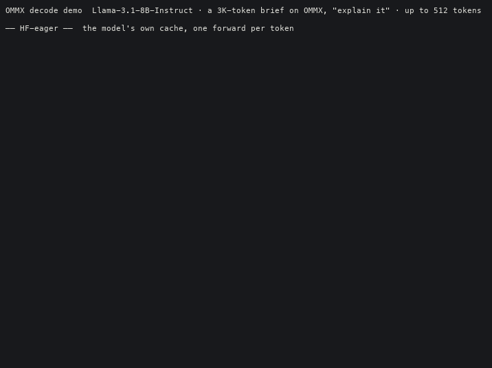
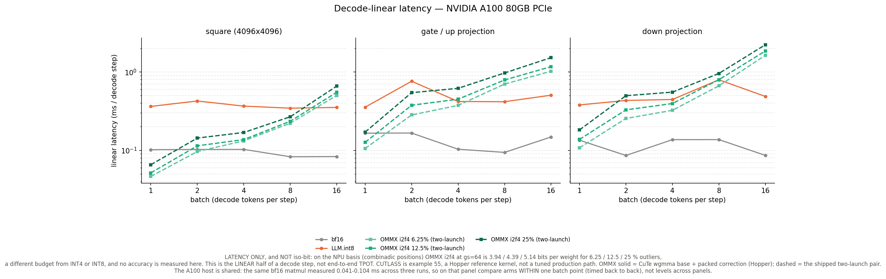

# High-Coverage Outlier Representation in Low-Bit MX Formats for Efficient LLM Inference (ICCAD 2026)

**OMMX (Outlier-Managed-MX)** is a dual-resolution MX format: MXINT2 for the dense majority, MXFP4
for a high-coverage outlier region under a shared power-of-two scale. This repository is the **GPU
half** of the artifact — the accuracy evaluation and the serving kernels for vLLM and HF-eager. The
Nucleus NPU (paper §3.2, §4.3) is a separate codebase and is not included.

Licensing: Apache-2.0 for our code; vendored trees are listed in [`THIRD_PARTY.md`](THIRD_PARTY.md).

Everything below is a result. What each number cost to measure, and what it cannot show, is
recorded in the docstrings of the code that produced it — `figure/plot.py`, `figure/collect.py`,
`ommx_gpu_serve/bench/`, and the tests under `ommx_gpu_serve/tests/`, which state the property
each one gates and why.

---

## Demo

|  |
|:--:|
| One request per arm on one H200: a ~3K-token brief on OMMX itself (`demo/ommx_brief.md`) and a question asking the model to explain the format and quote three facts from it (the base format, the outlier format, the 64K H200 vLLM latency), answered in up to 512 greedy tokens. HF-eager arms (KIVI, Kitty, bf16, OMMX; the model's own cache, one forward per token) and vLLM arms (bf16 FlashAttention, TurboQuant 3-bit, OMMX; paged KV, CUDA graph). Each line ends with the evidence that the arm's own kernel served the tokens. Recorded with `demo/run_all.sh` (`PROMPT=needles` records the long-context needle variant instead); the numbers below come from the benches, not from this one request. |

---

## Accuracy

|  |
|:--:|
| **Table 1** — KV-cache (left) and weight (right) quantization vs KIVI / KVQ / Oaken / AWQ / GPTQ / MXFP4. |

|  |
|:--:|
| **Fig. 6** — RULER-32K vs outlier ratio (weight / KV / joint WKV): accuracy recovers as outlier coverage grows. |

---

## Decode TPOT

Llama-3.1-8B, batch 1, greedy, seed 42, per-step p50; each panel is one day on one machine
(H200 NVL and A100 80GB PCIe). Raw per-step logs: `figure/data_h200_final/`, `figure/data_a100_w2/`.

|  |
|:--:|
| **H200** |

|  |
|:--:|
| **A100 80GB PCIe** — OMMX vLLM 64K 38.3 ms, KIVI ×7.7 / HF-eager ×5.3 |

Both OMMX bars run the **same recipe** — K = MXINT2 + 6 MXFP4 outliers per 32-token /
32-channel group, V = INT2, sink 8, recent 32, flat-bitmask outlier positions — and **both are
split into their internal kernel stages**, with each stage's share of that bar printed on it.
That recipe is the serving default and the one every accuracy number above is measured under.

Speedup over KIVI on **H200**, the two OMMX paths kept separate because they answer different
questions:

| ctx | KIVI (ms) | OMMX HF-eager | ×N | OMMX vLLM | ×N |
|--:|--:|--:|--:|--:|--:|
| 1K | 28.45 | 18.08 | 1.57× | 8.63 | 3.30× |
| 4K | 28.20 | 18.24 | 1.55× | 6.99 | 4.03× |
| 16K | 53.11 | 18.94 | 2.80× | 10.66 | 4.98× |
| 32K | 90.21 | 22.21 | 4.06× | 14.56 | 6.20× |
| 64K | 163.92 | 30.43 | 5.39× | 22.63 | **7.24×** |

**HF-eager** is the KV-kernel comparison (same framework as KIVI); **vLLM** adds the engine.
The vLLM arm runs the engine's default block size 16 (`--block-size 32` is supported and verified
but costs +26% at 4K). Per-token decode still runs above bf16 (14.3 ms Triton / 5.8 ms
FlashAttention at 64K vs OMMX 22.6): the win over bf16 is KV capacity, not speed. KIVI and Kitty
run fp16 as their kernels require; dtypes are printed on the legend.

## Decode-linear latency

The linear half of a decode step: OMMX i2f4 weights against bf16, CUTLASS mixed-input INT4 and
LLM.int8 as the batch grows. Latency only, not iso-bit, no accuracy measured here.

|  |
|:--:|
| **H200** — OMMX = CuTe wgmma base + packed correction (solid); the two-launch pair dashed |

|  |
|:--:|
| **A100 80GB PCIe** — two-launch pair only (CuTe and CUTLASS ex55 are Hopper-only). Shared host: the same bf16 matmul measured 0.041-0.104 ms across three runs, so compare arms within one batch point, not levels across panels. |

Square shape, 6.25% outliers, batch 1: H200 two-launch 0.0277 ms, CuTe 0.0400,
bf16 0.0358, CUTLASS INT4 0.0404, LLM.int8 0.0974; A100 two-launch
0.0463 vs bf16 0.1038 and LLM.int8 0.3637. The two-launch pair wins at batch 1
and the CuTe base from batch 2 on; the outlier correction grows with batch while bf16,
CUTLASS and int8 stay flat.

## Citation

```bibtex
@inproceedings{ommx2026,
  title     = {High-Coverage Outlier Representation in Low-Bit MX Formats for Efficient LLM Inference},
  booktitle = {IEEE/ACM International Conference on Computer-Aided Design (ICCAD)},
  year      = {2026}
}
```

## License

Apache-2.0. See [LICENSE](LICENSE).
